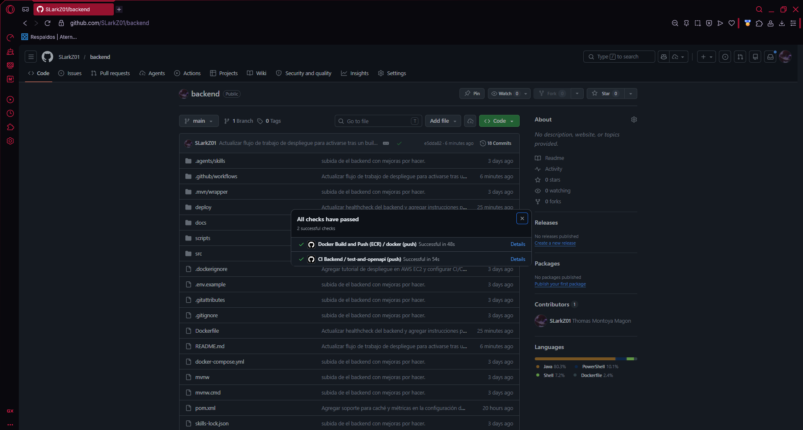
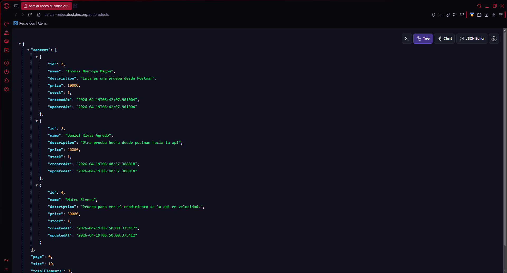
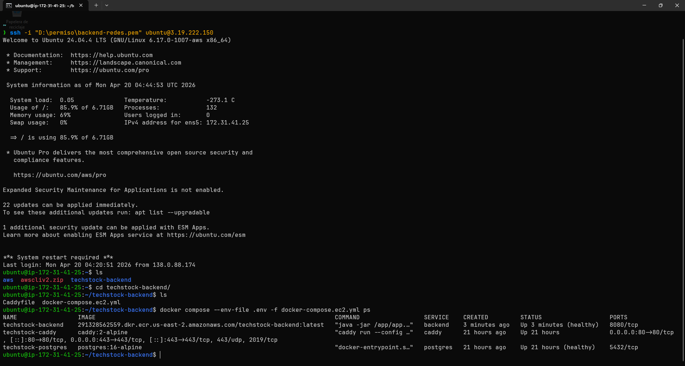
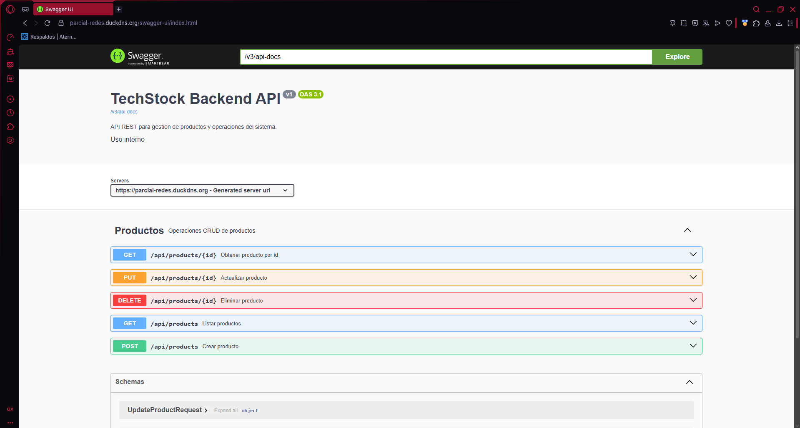
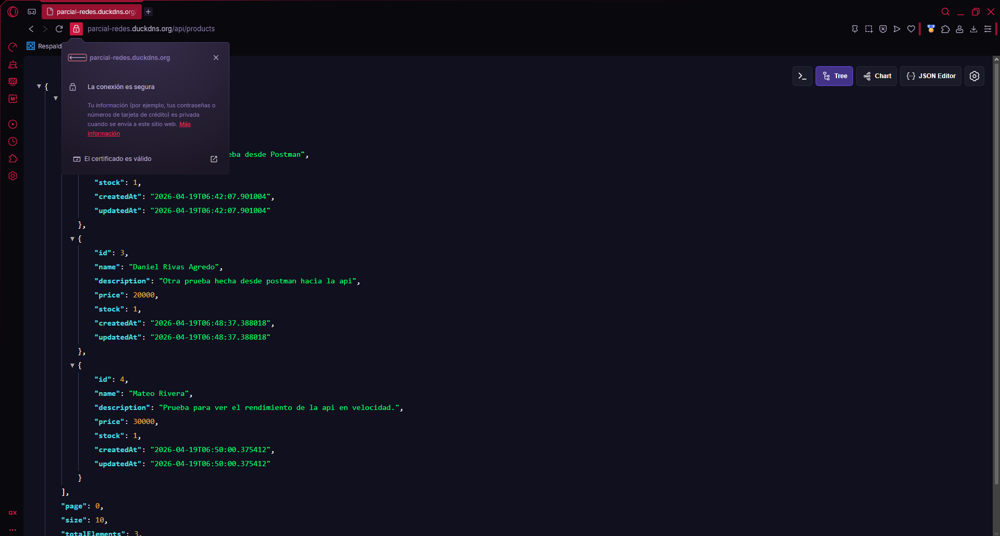

# 🚀 TechStock Backend - DevOps (Spring Boot + AWS)

Backend REST de productos desplegado en produccion real con arquitectura contenerizada, HTTPS y pipeline CI/CD automatizado en AWS.


---

## 🌐 Demo en produccion

- API base: `https://parcial-redes.duckdns.org`
- OpenAPI JSON: `https://parcial-redes.duckdns.org/v3/api-docs`
- Swagger UI: `https://parcial-redes.duckdns.org/swagger-ui.html`

> [!IMPORTANT]
> Este proyecto fue construido como practica de parcial de redes, cumpliendo el objetivo de desplegar una aplicacion web en produccion con base de datos usando contenedores.

---

## 🧭 Arquitectura


### Flujo principal

1. 👤 Cliente (Navegador/Postman/Frontend Vercel) consume el dominio HTTPS.
2. 🌍 DuckDNS resuelve el dominio de la instancia EC2.
3. 🔐 Caddy termina TLS y enruta trafico al backend.
4. ⚙️ Spring Boot procesa la logica y accede a PostgreSQL.
5. 🐳 Todo corre en contenedores Docker Compose dentro de EC2.
6. 🔄 GitHub Actions compila, publica en ECR y despliega por SSH.

---

## ✨ Lo mas destacado del proyecto

- ✅ CRUD de productos con validaciones y paginacion.
- ✅ OpenAPI separado por contrato (`ProductsApi`) + controlador limpio.
- ✅ Manejo global de errores con respuestas consistentes.
- ✅ CORS configurable por entorno.
- ✅ Health checks y Actuator para operacion.
- ✅ Optimizaciones de rendimiento (Jetty, pool JDBC, cache Caffeine).
- ✅ CI/CD completo: test, build Docker, push ECR, deploy EC2.
- ✅ HTTPS real en produccion (Caddy + DuckDNS).

---

## 🧱 Stack tecnico

- ☕ Java 25
- 🍃 Spring Boot 4 (Web MVC, Validation, Data JPA, Actuator)
- 🗄️ PostgreSQL 16
- 🐳 Docker / Docker Compose
- 🔐 Caddy (reverse proxy + TLS)
- ☁️ AWS EC2 + Amazon ECR
- 🔄 GitHub Actions
- 📘 springdoc OpenAPI

---

## 📁 Estructura del proyecto

```text
src/main/java/com/proyecto/redes/backend/
├─ config/
├─ products/
│  ├─ contract/
│  ├─ controller/
│  ├─ dto/
│  ├─ entity/
│  ├─ exception/
│  ├─ mapper/
│  ├─ repository/
│  └─ service/
└─ shared/api/
```

---

## ⚙️ Ejecucion local rapida

### 1) Levantar PostgreSQL

```bash
docker compose up -d
docker compose ps
```

### 2) Levantar backend

```bash
./mvnw spring-boot:run
```

Windows PowerShell:

```powershell
.\mvnw.cmd spring-boot:run
```

### 3) Ejecutar tests

```bash
./mvnw -q test
```

---

## 📘 OpenAPI y exportacion automatica

- Swagger UI local: `http://localhost:8080/swagger-ui.html`
- OpenAPI local: `http://localhost:8080/v3/api-docs`

Exportar specs:

```powershell
powershell -ExecutionPolicy Bypass -File .\scripts\export-openapi.ps1
```

```bash
chmod +x scripts/export-openapi.sh
./scripts/export-openapi.sh
```

Archivos generados:

- `docs/openapi/openapi.json`
- `docs/openapi/openapi.yaml`

---

## 🔄 CI/CD en GitHub Actions

### CI (`.github/workflows/ci-backend.yml`)

- Levanta PostgreSQL de pruebas.
- Ejecuta tests.
- Exporta OpenAPI.
- Publica artifacts.

### Build & Push (`.github/workflows/docker-backend.yml`)

- Construye imagen Docker.
- Publica imagen a Amazon ECR (`latest` y SHA).

### CD (`.github/workflows/deploy-ec2.yml`)

- Se dispara despues de un build exitoso en `Docker Build and Push (ECR)`.
- Se conecta por SSH a EC2.
- Actualiza `IMAGE_URI` en `.env`.
- Ejecuta `docker compose pull` y `docker compose up -d`.

> [!TIP]
> El proyecto ya aplica CI y CD. Cada push a `main` dispara integracion, build y despliegue automatico.

---

## 🔐 Variables criticas de produccion (.env en EC2)

```env
IMAGE_URI=<account>.dkr.ecr.<region>.amazonaws.com/techstock-backend:latest
SPRING_PROFILES_ACTIVE=prod
JPA_DDL_AUTO=update
SERVER_HTTP2_ENABLED=false
POSTGRES_DB=techstock_db
POSTGRES_USER=techstock_user
POSTGRES_PASSWORD=<password_segura>
DB_POOL_MAX_SIZE=5
DB_POOL_MIN_IDLE=1
JETTY_THREADS_MAX=50
JETTY_THREADS_MIN=8
CORS_ALLOWED_ORIGINS=https://frontend-redes.vercel.app
```

> [!WARNING]
> Nunca subas `.env` real al repositorio. Usa `deploy/ec2.env.example` como plantilla y maneja secretos desde GitHub/AWS.

---

## 🖼️ Evidencias del proyecto

### 1) Pipeline exitoso en GitHub Actions



### 2) API en produccion respondiendo



### 3) Contenedores activos en EC2



### 4) Swagger/OpenAPI publicado



### 5) Seguridad HTTPS valida



---

## 📚 Documentacion complementaria

- Guia completa de despliegue: `docs/tutorial/comandos-despliegue.md`
- Compose de EC2: `deploy/docker-compose.ec2.yml`
- Plantilla de entorno EC2: `deploy/ec2.env.example`

---

## 👨‍💻 Autores

- Daniel Rivas Agredo
- Mateo Rivera
- Thomas Montoya Magon

Proyecto academico orientado a backend + redes + DevOps, con foco en despliegue real, observabilidad y buenas practicas de produccion.
